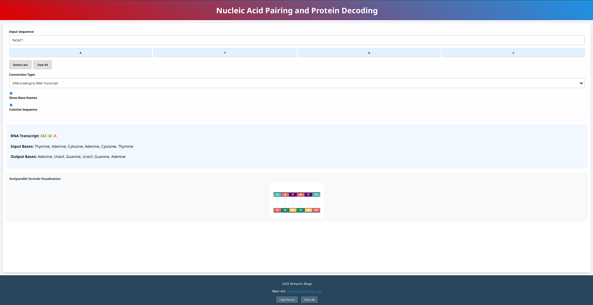

# Nucleic Acid Pairing
> An interactive web application for exploring DNA and RNA sequences: convert between nucleic acids, compute complements and transcripts, and translate RNA (or coding‑strand DNA) into proteins.
## Table of Contents
* [Features](#features)
* [Demo](#demo)
* [Prerequisites](#prerequisites)
* [Installation & Usage](#installation--usage)
* [File Structure](#file-structure)
* [Customization](#customization)
* [License](#license)
---
## Features
* **Sequence Input**
  Type or build a DNA/RNA sequence base by base.
* **Conversion Modes**
  * DNA → Complementary DNA
  * DNA (coding strand) → RNA transcript
  * RNA → Complementary RNA
  * RNA → Protein translation
  * DNA (coding strand) → Protein translation
* **Protein Decoding**
  Uses the standard genetic codon table to break RNA into codons, display tRNA anticodons, and name each amino acid.
* **Interactive UI**
  * Highlight and fade effects on sequence updates
  * Show or hide full base‑name expansions (e.g. “Adenine, Thymine…”)
  * Responsive design for desktop and mobile
* **Lightweight & Accessible**
  * Built with plain HTML, CSS, and jQuery/UI
  * Fastify static server with no-cache headers
---
## Demo
- View the live demo at:
- [https://dna.richardsblogs.com](https://dna.richardsblogs.com)
- *Or* after installation (below), open your browser to `http://localhost:6001`
- Examples
    - 
    - 
    - 
    - 
    - 
---
## Prerequisites
* [Node.js](https://nodejs.org/) ≥ v14
* Internet access for CDN assets (or local fallbacks provided)
* Modern web browser with JavaScript enabled
---
## Installation & Usage
1. **Clone the repository**
   ```bash
   git clone https://github.com/richie-rich90454/nucleic-acid-pairing.git
   cd nucleic‑acid‑pairing
   ```
2. **Install dependencies**
   ```bash
   npm install
   ```
   This installs Fastify and its static plugin.
3. **Start the server**
   ```bash
   node server.js
   ```
   The app will start on port **6001** by default.
   Open your browser at → `http://localhost:6001`
---
## File Structure
```
NUCLEIC‑ACID‑PAIRING/
├── node_modules/                     # npm dependencies (Fastify + plugins)
├── .gitignore
├── LICENSE                           # MIT license
├── package.json                      # project metadata & dependencies
├── README.md                         # this file
├── favicon.ico                       # favicon & social preview image
├── NotoSansSC‑VariableFont_wght.ttf  # embedded font
├── index.html                        # markup & inline styles
├── jquery-3.7.1.js                   # local fallback if CDN fails
├── jquery-ui.min.css                 # local fallback if CDN fails
├── jquery-ui.min.js                  # local fallback if CDN fails
├── script.js                         # conversion & UI logic
└── server.js                         # Fastify static file server
```
---
## Customization
* **Styling**: CSS is inline in `index.html`; extract or override in a separate stylesheet.
* **Codon Table**: In `script.js`, customize the `codonTable` object for different naming schemes.
* **Server Settings**: Modify `server.js` for custom ports, caching policies, or additional routes.
---
## License
- This project is licensed under the **MIT License**. See [LICENSE](LICENSE) for details.
---